# simple-search-engine
This repo is a simple study of **Information Retrieval** (IR), it's a simple search engine tool implemented using Python3. It uses [Cranfield experiments](https://en.wikipedia.org/wiki/Cranfield_experiments) [dataset](http://ir.dcs.gla.ac.uk/resources/test_collections/cran/) to evaluate retrieved results.

# Table of contents
- [Installing](#installing)
- [Usage](#usage)
  * [Using the Indexer](#using-the-indexer)
    + [Creating the Indexer](#creating-the-indexer)
    + [Creating schema file](#creating-schema-file)
    + [Printing indexed documents statics](#printing-indexed-documents-statics)
  * [Creating and using the Retriever](#creating-and-using-the-retriever)
    + [Make a query](#make-a-query)
    + [Getting benchmarks](#getting-benchmarks)
- [How it works](#how-it-works)
  * [Crawler](#crawler)
  * [Indexer](#indexer)
    + [preprocess](#preprocess)
    + [schema](#schema)
  * [Retriever](#retriever)
    + [create vectors](#create-vectors)
    + [cosine similarity](#cosine-similarity)
    + [query](#query)
- [Credits](#credits)

# Installing 

```sh
git clone https://github.com/eLMoMaNi/simple-search-engine
cd ./simple-search-engine
pip install -r requirements.txt
#copy files to site-packages or create your files in same directory
```

# Usage
## Using the Indexer
### Creating the Indexer 

```python
from indexer import Indexer
indexer = Indexer('/path/to/cranfield_data.json')
```
Cranfield collection must be converted to a json file.
### Creating schema file

```python
indexer.create_schema_file("schema.json")
```
### Printing indexed documents statics

```python
indexer.print()
```
this will print some info like this:

```dart
Number of tokens: 140979
The number of unique words: 4500
The number of words that occur only once: 1488
The 10 most frequent words: flow, pressur, number, boundari \...
```
## Creating and using the Retriever

```python
retriever = Retriever("schema.json")
```
once the Retriever is created. we can use it to seach documents (make queries).
### Make a query
This shows how to get top `100` documents for a query.

```python
docs, = retriever.query("how to hack NASA using HTML",100)
```
### Getting benchmarks

```python
docs, = retriever.query("how to hack NASA using HTML",100\
                        ,get_bench=True, relevance_docs=[<doc IDs>])
```
relevance_docs gets a list of IDs of the relevent documents to evalute the `Accuracy, F1 , Precision and Recall`.

# How it works


<a href="https://raw.githubusercontent.com/eLMoMaNi/simple-search-engine/main/doc/flow_chart.svg"></a>


## Crawler

```python
raise NotImplementedError # :(
```
this project *-currentlly-* uses [cranfield dataset](http://ir.dcs.gla.ac.uk/resources/test_collections/cran/) instead of crawling the web.

## Indexer 
This module used to create the index schema.
### preprocess
This includes clean the documents and tokenize them as follow:
* stemming all words using `PorterStemmer`
* removing stop words using `nltk.corpus.stopwords`
* removing words with less than 2 letters
* tokenizing words using regex `\w+`

### schema
The schema created by the Indexer has the following structure
```c#
{
    "token1":
    {
        "doc1":<tf_value>,
        "doc2" :<tf_value>,
        "doc3":<tf_value>,
        "idf":<idf_value>
    },
    "token2":{...}...
}
```
you can see that the structure is very squeezed to favour space complexity over readability.

>***Note:*** `"idf"` is not allowed as document id, as it's used to indecate the term's idf.

## Retriever
This module used to retriever and search from the schema.
### create vectors
When a query is made, the Retriever creates a normalized `tf-idf` weight vector for both the query tokens and all documents. Retriever uses the SMART notation `ltc.lnc`.

|                         | Query </br> `l`(log) `t`(idf) `c`(cosine)                                                                                                                                               | Document </br> `l`(log) `n`(none) `c`(cosine)                                                                               |
|-------------------------|-----------------------------------------------------------------------------------------------------------------------------------------------------|------------------------------------------------------------------------------------------|
| Term Frequency (tf)     |                                                             |  |
| Document Frequency (df) |                                                            |                                                                              |
| Normalization           |  |                                                                              |

### cosine similarity
To calculate how much the document is relevent to the query. </br>
we use cosine similarity (dot product) between the query vector and the document vector.

### query
```python
        doc_scores = {}
        for doc in doc_vectors:
            doc_scores[doc] = \
                self.__cos_similarity(query_vector, doc_vectors[doc])

        # sort docs by thier scores
        sorted_docs = sorted(doc_scores.items(), key=operator.itemgetter(1))
        # get only top `k` docs ids
        top_docs = [i[0] for i in sorted_docs[-k:][::-1]]
```
Cosine similarities for all documents are stored in `doc_scores` dictionary with document id is the key.
the dictionary then is sorted by its values(scores) and top `k` documents are returned.


# Credits

 - [tqdm](https://github.com/tqdm/tqdm) for the porgress bar
 - [Dr. Malak  Abdullah](https://sites.google.com/view/malak-abdullah/home) for the course project
 - Cranfield University for the dataset
 - [me @_@](https://github.com/eLMoMaNi) as the creator of the repo
