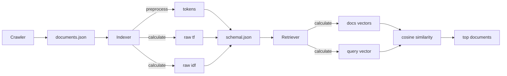

```mermaid!
graph LR
    A[Crawler] --> B

    B[documents.json] -->C

    C[Indexer]
    C -->|preprocess|D
    C -->|calculate|E
    C -->|calculate|F

    D[tokens] -->G
    E[raw tf] -->G
    F[raw idf] -->G

    G[schemal.json] -->H
    
    H[Retriever]
    H -->|calculate| J
    H -->|calculate| I
    

    I[docs vectors] -->K
    J[query vector] -->K

    K[cosine similarity] --> L
    
    L[top documents]
```